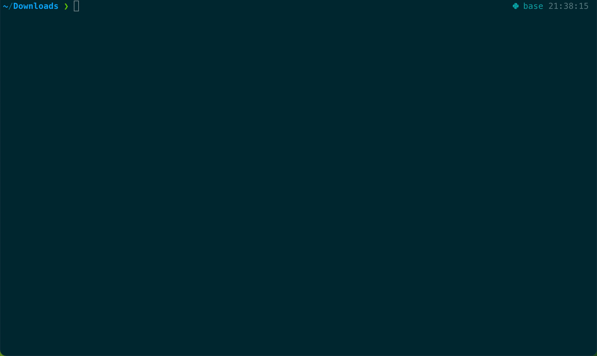

# 文本分句 & 纠错



## 多语言分句

支持中文及其他语言的分句。对中文进行特别的校准，如：

```
布鲁克林河（Brooklin River），澳洲原生 Māori 部落称其为莫克伊-米加尔塔-阿特瓦河（Mokihinui River），它隐藏在新西兰西岸的峡谷间。// 布鲁克林河 是很少被人知晓的美丽河流...

这条河流勾勒着大自然的绝美画卷。清澈的河水从高耸的山脉间流淌而下，映衬着原始森林，勾勒着一幅令人心醉的画卷。

河水从峡谷间蜿蜒流淌，穿过原始森林，宛如大自然的心跳。缓缓流动的河水，仿佛一首古老的诗歌，述说着它的历史和美丽。

对于 Māori 部落而言，这是一片神圣之地，自然与精神交织在一起。

As the sun sets, 河水倒映出熊熊燃烧的色彩，给天空和水面披上了一层深红和金色的轻纱。

布鲁克林河，一条鲜为人知的河流，却是大自然鬼斧神工的杰作，绽放着无与伦比的美丽。
```

分句如下：
```
> hlvst -z test.txt

test.txt:
0: 布鲁克林河（Brooklin River），澳洲原生 Māori 部落称其为莫克伊-米加尔塔-阿特瓦河（Mokihinui River），它隐藏在新西兰西岸的峡谷间。
1: 布鲁克林河 是很少被人知晓的美丽河流...
2: 这条河流勾勒着大自然的绝美画卷。
3: 清澈的河水从高耸的山脉间流淌而下，映衬着原始森林，勾勒着一幅令人心醉的画卷。
4: 河水从峡谷间蜿蜒流淌，穿过原始森林，宛如大自然的心跳。
5: 缓缓流动的河水，仿佛一首古老的诗歌，述说着它的历史和美丽。
6: 对于 Māori 部落而言，这是一片神圣之地，自然与精神交织在一起。
7: As the sun sets, 河水倒映出熊熊燃烧的色彩，给天空和水面披上了一层深红和金色的轻纱。
8: 布鲁克林河，一条鲜为人知的河流，却是大自然鬼斧神工的杰作，绽放着无与伦比的美丽。
```

其他语言如：

```
Certainly! Here's a 100-word essay praising the beauty of the Brooklin River, incorporating English with a mix of Japanese and Hindi:

Nestled in New Zealand's serene landscapes, the Brooklin River, known as Mokihinui in Maori, is a hidden gem waiting to be discovered. The pristine waters meander through untouched valleys, "美しい" (utsukushī) cliffs rising alongside, reminiscent of 日本の美しい谷間 (Nihon no utsukushī tanima). Its allure, जो केवल कहने के लिए कम है (jo keval kahane ke lie kam hai), captivates the soul. The river's silence whispers tales, जैसे समय ने उसके ऊपर सौंपा हो (jaise samay ne uske upar saumpa ho), each ripple a chapter of nature's grandeur. 

The Brooklin River's essence, its शांति (shaanti), envelops all who venture near. Its banks echo ध्यान (dhyaan), inviting reflection amidst nature's canvas. Here, समय की गति धीमी हो जाती है (samay ki gati dheemi ho jaati hai), time slows to embrace the whispers of the flowing waters. It's a symphony, सुनने वाले की अनदेखी रह जाती है (sunne vaale ki anadekhi rah jaati hai), where even the observer remains unseen in the tranquility.

The Brooklin River stands as a testament to nature's artistry. Its beauty, जो अक्सर छिपा रहता है (jo aksar chipa rahta hai), often hidden from the bustling world, is a treasure trove for the intrepid explorer. Amongst the whispers of its name, lies a world waiting to be embraced, संगीत की भांति (sangeet ki bhaanti), like a melody echoing across cultures.
```

分句如下：
```
> hlvst test.txt

test.txt:
0: Certainly!
1: Here's a 100-word essay praising the beauty of the Brooklin River, incorporating English with a mix of Japanese and Hindi:
2: Nestled in New Zealand's serene landscapes, the Brooklin River, known as Mokihinui in Maori, is a hidden gem waiting to be discovered.
3: The pristine waters meander through untouched valleys, "美しい" (utsukushī) cliffs rising alongside, reminiscent of 日本の美しい谷間 (Nihon no utsukushī tanima).
4: Its allure, जो केवल कहने के लिए कम है (jo keval kahane ke lie kam hai), captivates the soul.
5: The river's silence whispers tales, जैसे समय ने उसके ऊपर सौंपा हो (jaise samay ne uske upar saumpa ho), each ripple a chapter of nature's grandeur.
6: The Brooklin River's essence, its शांति (shaanti), envelops all who venture near.
7: Its banks echo ध्यान (dhyaan), inviting reflection amidst nature's canvas.
8: Here, समय की गति धीमी हो जाती है (samay ki gati dheemi ho jaati hai), time slows to embrace the whispers of the flowing waters.
9: It's a symphony, सुनने वाले की अनदेखी रह जाती है (sunne vaale ki anadekhi rah jaati hai), where even the observer remains unseen in the tranquility.
10: The Brooklin River stands as a testament to nature's artistry.
11: Its beauty, जो अक्सर छिपा रहता है (jo aksar chipa rahta hai), often hidden from the bustling world, is a treasure trove for the intrepid explorer.
12: Amongst the whispers of its name, lies a world waiting to be embraced, संगीत की भांति (sangeet ki bhaanti), like a melody echoing across cultures.
```

## 纠错

中文文字纠错使用 [pycorrector](https://github.com/shibing624/pycorrector)，可参考源项目进行安装。  
纠错模型使用 **MacBert-CSC**，第一次执行命令会进行模型下载，预计 400M。
存储地址：`~/.cache/huggingface/hub/models--shibing624--macbert4csc-base-chinese`

## Command

```
hlvst --help                                                             

hlvst files a.md b.txt
hlvst folder ./
hlvst text It's a very nice day today. I made an appointment with a friend to play ball.

-c: need text correct.
-m: need parse markdown.
-z: open zh-cn sentence.
-n <num>: min sentence words.(default: 2)

For example:
hlvst files -c -m -z -n 10 unicode.md
```

## Code

```
import HLVSentence

// 中文分句
let r = HLVParse.parseZh(text, minWords: minWords)
// 其他语言分句
let r = HLVParse.parse(text, minWords: minWords)
```

对于中文分句，支持新增分句符号，可通过如下方式：

```
HLVParse.appendZhSymbol("///")
HLVParse.appendZhSymbol("//")
HLVParse.appendZhSymbol("/*")
HLVParse.appendZhSymbol("*/")
```

中文纠错，支持 block、async-await、Combine 三种方式获取异步数据：

```
import HLVSentence

do {
  let result = try await HLVTextCorrect.correct(_r)
} catch {
  print("Text Correct Field. May need to install python3 and pycorrector. see: https://github.com/shibing624/pycorrector")
}
```

## Installation CLI

```
brew tap yigegongjiang/tap
brew install hlvst
```

## Installation Library

By Swift Package Manager.

```
let package = Package(
    dependencies: [
        .package(url: "https://github.com/yigegongjiang/HLVSentence.git", .upToNextMajor(from: "1.0.2"))
    ],
    targets: [ .target(dependencies: [...,"HLVSentence"]) ]
)
```
